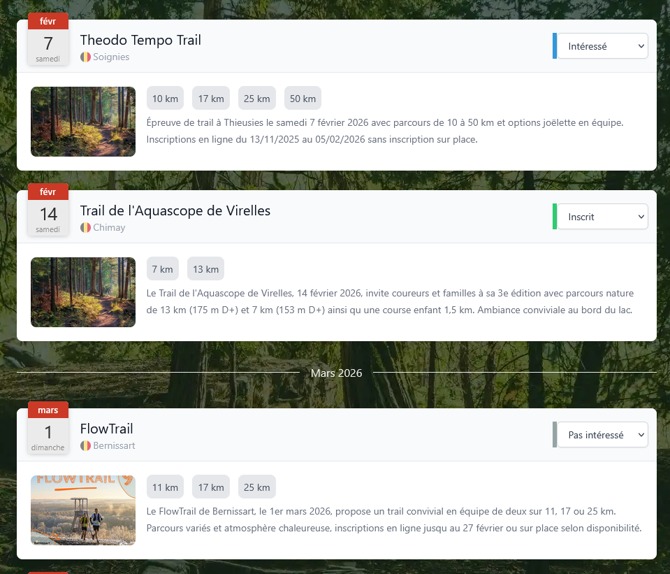

# Script Tampermonkey

Ce dépôt regroupe des scripts Tampermonkey pour les principaux sites de course à pied.
Ils permettent d’enregistrer un statut personnalisé sur chaque course (inscrit, intéressé, pas intéressé, etc.) directement sur le site concerné.

Ces scripts répondent à un besoin courant :

- se souvenir des courses auxquelles on est déjà inscrit
- identifier celles que l’on a déjà consultées
- éviter les doublons (consultation ou inscription)
- mieux organiser sa veille et ses inscriptions aux courses

## Go Trail

Ajout d'un select à la place du lien vers la course (le nom contient aussi le lien)



# Installation des scripts Tampermonkey

Ce dépôt contient plusieurs scripts Tampermonkey, organisés par site (un dossier = un site).
Ce README explique comment installer Tampermonkey puis installer un script depuis ce repo, de façon totalement autonome.

## 1. Prérequis

Un navigateur compatible :

- ✅ Chrome / Chromium (Chrome, Brave, Edge…)
- ✅ Firefox
- ✅ Safari (macOS)

Une connexion Internet

## 2. Installer l’extension Tampermonkey

### 🔹 Chrome / Edge / Brave

- Ouvrir le Chrome Web Store
- Rechercher Tampermonkey
- Cliquer sur Ajouter à Chrome
- Confirmer l’installation

👉 L’icône Tampermonkey (🟦) apparaît en haut à droite du navigateur

### 🔹 Firefox

- Ouvrir le site des extensions Firefox
- Rechercher Tampermonkey
- Cliquer sur Ajouter à Firefox
- Autoriser l’installation

### 🔹 Safari (macOS)

- Ouvrir le Mac App Store
- Rechercher Tampermonkey
- Installer l’application
- Activer Tampermonkey dans :
- Safari → Réglages → Extensions

## 3. Structure du dépôt

Le dépôt est organisé de la manière suivante :

```
repo/
├── site-1/
│   └── script.user.js
├── site-2/
│   └── script.user.js
└── site-3/
    └── script.user.js
```

Chaque dossier correspond à un site web

Chaque fichier script.user.js est un script Tampermonkey installable

## 4. Installer un script Tampermonkey depuis le dépôt

### Méthode recommandée (simple)

- Ouvrir le lien:
  - GoTrail: https://raw.githubusercontent.com/Coni63/tampermonkey/master/gotrail/script.user.js
- Tampermonkey détecte automatiquement le script
- Une page d’installation s’ouvre
- Cliquer sur Installer

✅ Le script est maintenant actif

### Méthode alternative (manuelle)

- Cliquer sur l’icône Tampermonkey
- Choisir Créer un nouveau script
- Supprimer le contenu par défaut
- Copier / coller le contenu du fichier \*.user.js
- Enregistrer (Ctrl + S)

## 5. Vérifier que le script fonctionne

- Cliquer sur l’icône Tampermonkey
- Vérifier que le script est :
  - ✅ Activé
  - ✅ Associé au bon site
- Ouvrir le site concerné et tester le comportement

## 6. Mettre à jour un script

Les mises à jour sont automatiques avec le lien de mise à jour dans le script.

## 7. Désactiver ou supprimer un script

- Ouvrir le Dashboard Tampermonkey
- Désactiver le script (toggle)
- Ou cliquer sur Supprimer

## 8. Dépannage

### ❌ Le script ne se lance pas

- Vérifier l’URL du site (@match / @include)
- Recharger la page (Ctrl + F5)
- Vérifier que Tampermonkey est activé

### ❌ Tampermonkey ne propose pas l’installation

- Vérifier que le fichier se termine par .user.js
- Ouvrir le fichier en mode Raw

## 9. Notes

- Les scripts sont exécutés côté navigateur
- Aucun accès serveur n’est requis
- Chaque utilisateur installe uniquement les scripts dont il a besoin

🚀 Bonne installation !

Si besoin, adaptez ce README en ajoutant une section spécifique par site ou par script.
